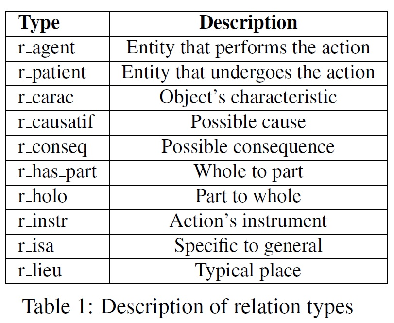

# RezoJDM-SDS (Semantic DataSet)
This is a subproject related to the creation of RezoJDM-SDS, French Semantic Relation DataSet with 10 semantic types. RezoJDM-SDS is extracted under several constraints from RezoJDM a French lexical-semantic network.

## Instruction:  

Simply download the `datasets` folder and use it for training machine learning models. There are two main columns in the datasets, namely, `source_name`,`destination_name` and the rest of columns are semantic relations: `r_agent`, `r_carac`, `r_causatif`, `r_conseq`, `r_has_part`, `r_holo`, `r_instr`, `r_isa`, `r_lieu`, `r_patient`.  

## RezoJDM-SDS: Description

RezoJDM-SDS is a Semantic DataSet created from RezoJDM. Among wide variety of possibilities, we have only focused on 10 most frequent semantic relations which belong to the ontological and predicative categories of RezoJDM and are more common in semantic linguistic analysis.  Relations with weights less than 50 are treated as negative in our dataset. 

<p align="center">
  
</p>

We have selected reliable relations with weights greater than 50 in RezoJDM. This constraint guarantees to select positive relations that have been validated more frequently by different players in the JDM game. 

<p align="center">
  
</p>

The descriptions and examples of the relation types are illustrated in tables. RezoJDM-SDS is gained by randomly splitting the initial dataset into two train and test samples (80\% and 20\%).  

<p align="center">
  
</p>

## Citations
```bibtex
@inproceedings{lafourcade2007making,
  title={Making people play for Lexical Acquisition with the JeuxDeMots prototype},
  author={Lafourcade, Mathieu},
  booktitle={SNLP'07: 7th international symposium on natural language processing},
  pages={7},
  year={2007}
}
```

### License
RezoJDM-SDS is released under the MIT license.

